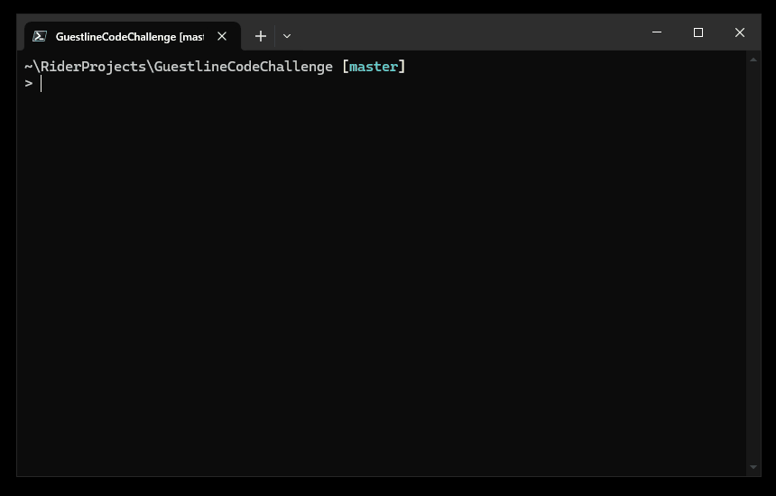

# Description

Project for Code Challenge for job interview at Guestline.

# How to run

Clone and build:

```sh
git clone https://github.com/mpawelski/GuestlineCodeChallenge.git
cd .\GuestlineCodeChallenge
dotnet build
```

Run with `dotnet run`:

```sh
cd .\GuestlineCodeChallenge\
dotnet run --hotels ..\hotels.json --bookings ..\bookings.json
```

(_alternative_) or run the compiled exe:

```sh
.\GuestlineCodeChallenge\bin\Debug\net8.0\GuestlineCodeChallenge.exe --hotels .\hotels.json --bookings .\bookings.json
```

# How to run Unit Tests

```sh
dotnet test
```

or run the solution in Visual Studio or Rider and run all tests in solution.

# Example run

